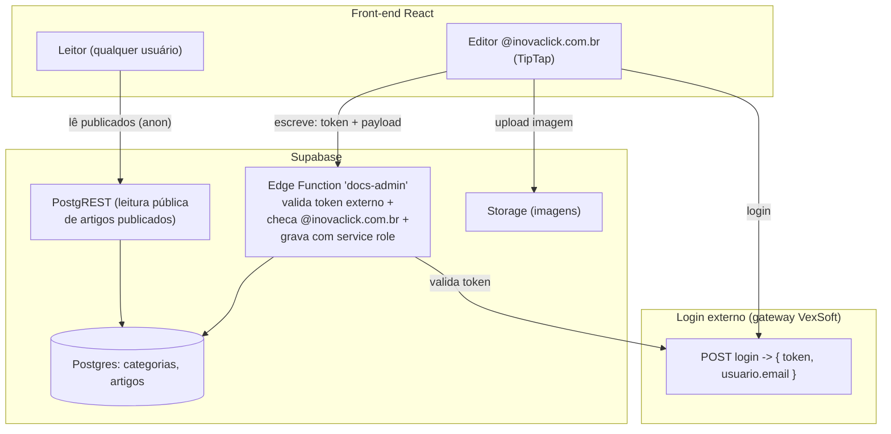

# Análise: Modernização da Base de Conhecimento (editor rico + permissões)

**Projeto:** `checklist-guidebook` — Central de Ajuda VEXSOFT
**Stack:** Vite + React + TypeScript + shadcn/ui + React Router + TanStack Query + Supabase (Postgres/API)
**Foco desta análise:** editor rico estilo Notion/Confluence/GitBook e o modelo correto de permissões (autenticação externa, sem Supabase Auth).

---

## 1. Como a documentação funciona atualmente

Há dois estados convivendo hoje, resultado da migração em andamento:

- **Legado (ainda a maior parte):** cada artigo é um componente `.tsx` em `src/pages/` com o conteúdo escrito em arrays/JSX. A navegação está em `DocSidebar.tsx` e a busca em `SearchBar.tsx` — três fontes de verdade mantidas à mão.
- **Novo (parcial):** banco Supabase com tabelas `categorias`/`artigos` (corpo em **Markdown**), API REST, busca full-text, e uma tela de gerenciamento (`/gerenciar`) com CRUD. O artigo é renderizado por `Artigo.tsx` via `react-markdown`.

A leitura do conteúdo dinâmico usa `react-markdown` (só Markdown puro: títulos, negrito, listas, links e tabelas). Não há suporte a imagens hospedadas, vídeos incorporados, blocos de código com destaque de sintaxe, nem avisos/callouts.

## 2. Problemas da implementação atual

1. **Descompasso de autenticação (crítico).** A segurança dos dados foi montada sobre **RLS keyed no JWT do Supabase** (`is_inovaclick()` lê `auth.jwt()->email`). Mas o login real é **externo** — não gera JWT do Supabase. Resultado: todo acesso chega "anônimo" e o RLS bloqueia tudo, então **a tela de gerenciamento não carrega nem salva**. É a causa direta da lista vazia.
2. **Leitura indevidamente restrita.** As políticas de leitura exigem `@inovaclick.com.br`. Pelo novo requisito, a documentação deve ser **visível a todos** (somente edição é restrita). A leitura precisa ser pública.
3. **Editor pobre para o objetivo.** `react-markdown` + textarea não entrega a experiência Notion/Confluence pedida: sem imagens, vídeos incorporados, blocos de código destacados, callouts, ou edição por blocos.
4. **Conteúdo ainda no código (legado).** Publicar exige alterar código e deploy; três fontes de verdade sincronizadas manualmente.

## 3. Tecnologias/bibliotecas indicadas

Para o **editor** (o coração do pedido):

| Opção | O que é |
|-------|---------|
| **TipTap** (ProseMirror) | Editor headless para React. Extensões oficiais para imagem, tabela, blocos de código com highlight, link, YouTube, e nós customizados (callouts/avisos). Estiliza com Tailwind/shadcn. Saída HTML ou JSON. |
| **BlockNote** | Editor por blocos "Notion-like" pronto (slash commands, arrastar blocos, imagens, tabelas). Construído sobre ProseMirror. Saída em blocos JSON (converte p/ Markdown/HTML). |
| **Editor.js** | Editor por blocos com plugins (embed, code, table). Saída JSON. Menos "React-native". |
| **Lexical** (Meta) | Muito performático e extensível, porém exige mais trabalho para chegar à paridade Notion. |
| **Markdown turbinado** | Manter Markdown, com editor `@uiw/react-md-editor` + `react-markdown` estendido (`rehype-raw`, `remark` plugins) para embeds/callouts. |

Bibliotecas de apoio (qualquer que seja o editor): `rehype-sanitize`/`DOMPurify` (sanitização de HTML), `lowlight`/`highlight.js` (destaque de código), Supabase **Storage** (upload de imagens).

## 4. Prós e contras

**TipTap** — ✅ paridade Notion com controle total; integra com shadcn/Tailwind (headless); extensível para avisos/embeds; comunidade grande e madura. ❌ curva de setup maior; decidir/So sanitizar HTML na renderização.

**BlockNote** — ✅ experiência Notion pronta com menos código; ótimo para usuários internos. ❌ estilo próprio pode conflitar com o tema shadcn/Tailwind; saída em JSON próprio (menos portável); menos maduro.

**Editor.js** — ✅ blocos + JSON limpo. ❌ integração React mais trabalhosa; gestão de plugins; SSR/estilo.

**Lexical** — ✅ performático, base sólida. ❌ muito trabalho para recriar recursos que TipTap já entrega prontos.

**Markdown turbinado** — ✅ menor mudança, mantém portabilidade e o conteúdo já migrado; sem lock-in. ❌ não é WYSIWYG por blocos; imagens/vídeos/callouts ficam menos intuitivos para quem não conhece Markdown.

## 5. Solução recomendada e justificativa

**Editor: TipTap, guardando o conteúdo como HTML sanitizado** (coluna nova `conteudo_html`), com upload de imagens no **Supabase Storage**.

Por quê: entrega a experiência rica pedida (imagens, vídeos YouTube/Vimeo, blocos de código com highlight, tabelas, listas, links, **callouts/avisos** via nó customizado), é **headless** — casa com o padrão atual de shadcn/Tailwind e componentes reutilizáveis — e é o mais maduro/escalável. BlockNote seria a alternativa "Notion instantâneo", mas o estilo próprio atrita com o tema atual e o formato de dados é menos portável. Manter o Markdown atual como *fallback* de leitura preserva os artigos já migrados.

**Backend/dados: manter Supabase (Postgres + API)**, que já está pronto — mudam apenas as **políticas de acesso** para refletir a autenticação externa (ver seção 7).

## 6. Nova arquitetura do módulo

Fluxo:
- **Leitura:** pública. Qualquer visitante lê os artigos **publicados** direto pela API (chave publishable/anon). Rascunhos não aparecem.
- **Escrita (criar/editar/excluir):** o front-end **nunca** grava direto. Envia o **token do login externo + o conteúdo** para a Edge Function `docs-admin`, que valida o token no gateway, confirma o domínio `@inovaclick.com.br` e grava com a **service role** (contornando o RLS de forma segura, no servidor).
- **Componentes reutilizáveis:** um `<RichEditor/>` (TipTap) para edição e um `<RichContent/>` para renderização sanitizada — usados tanto no gerenciamento quanto na página pública, sem duplicação.

## 7. Controle de permissões (sem Supabase Auth)

- **Fonte da identidade:** o usuário retornado pelo **login externo atual** (já disponível no `AuthContext`, campo `user.email`).
- **Regra de admin:** `email.toLowerCase().endsWith("@inovaclick.com.br")`. Centralizada num único helper (`isAdmin(user)`) reutilizado na UI e no guard de rota.
- **No front-end (UX):** botões/menu de edição e a rota `/gerenciar` só aparecem para admin. Não-admin tem apenas leitura.
- **No servidor (enforcement real):** a Edge Function `docs-admin` **revalida o token externo** a cada escrita e rejeita quem não for `@inovaclick.com.br`. É isso que impede que alguém burle o front-end e grave direto.
- **RLS ajustado:** `select` público apenas de `status = 'publicado'`; **nenhuma** política de `insert/update/delete` para o cliente (anon/authenticated) — escrita só pela service role via Edge Function.

> Ponto aberto (necessário para o enforcement): a Edge Function precisa de **um jeito de validar o token no servidor** — um endpoint de verificação do gateway, ou o token sendo um JWT verificável. É o único item que falta para fechar a escrita com segurança.

## 8. Plano de migração do código

1. **Ajustar permissões no banco:** trocar RLS de leitura para pública (`status='publicado'`); remover políticas de escrita do cliente. → *verificar: anônimo lê publicados; anônimo não escreve.*
2. **Edge Function `docs-admin`:** validar token externo, checar domínio, executar create/update/delete com service role. → *verificar: escrita só com token @inovaclick.com.br válido.*
3. **Editor rico:** adicionar TipTap; criar `<RichEditor/>` e `<RichContent/>`; coluna `conteudo_html`; imagens no Storage. → *verificar: inserir imagem, vídeo, código, tabela, aviso e salvar.*
4. **Refatorar permissões no front:** helper `isAdmin(user)` a partir do `AuthContext`; guard e UI passam a usar o e-mail externo (remover dependência de sessão Supabase / a tela `/login-equipe` de e-mail-senha deixa de ser necessária).
5. **Camada de dados:** leitura continua via PostgREST; escrita passa a chamar a Edge Function.
6. **Migrar conteúdo Markdown → HTML** (uma vez) ou renderizar Markdown antigo como fallback; concluir a migração dos artigos legados restantes.
7. **Limpeza:** remover as três fontes de verdade legadas (páginas `.tsx`, `searchData`, sidebar estática) conforme o conteúdo entra no banco.

---

### Decisões que preciso confirmar antes de implementar

1. **Editor:** TipTap (recomendado) vs BlockNote vs Markdown turbinado.
2. **Validação de escrita no servidor:** qual endpoint do gateway valida um token já emitido (ou o token é um JWT)? Um exemplo da resposta do login resolve.
