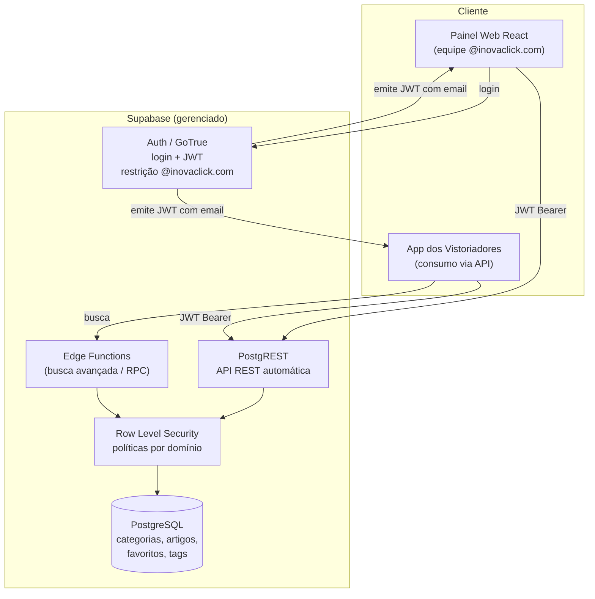
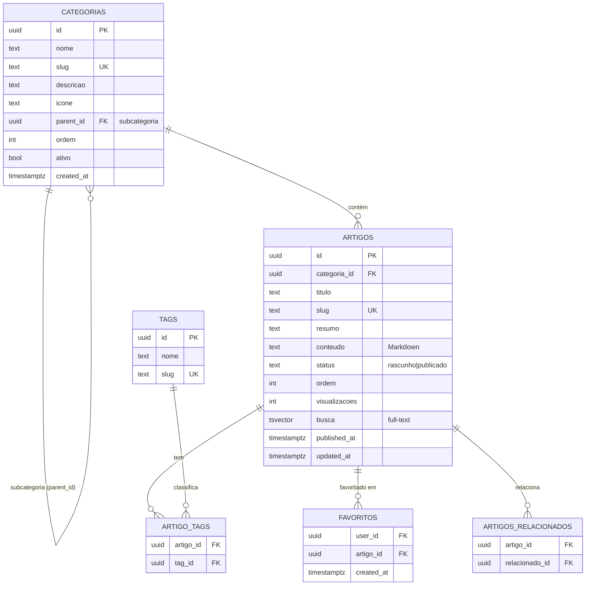
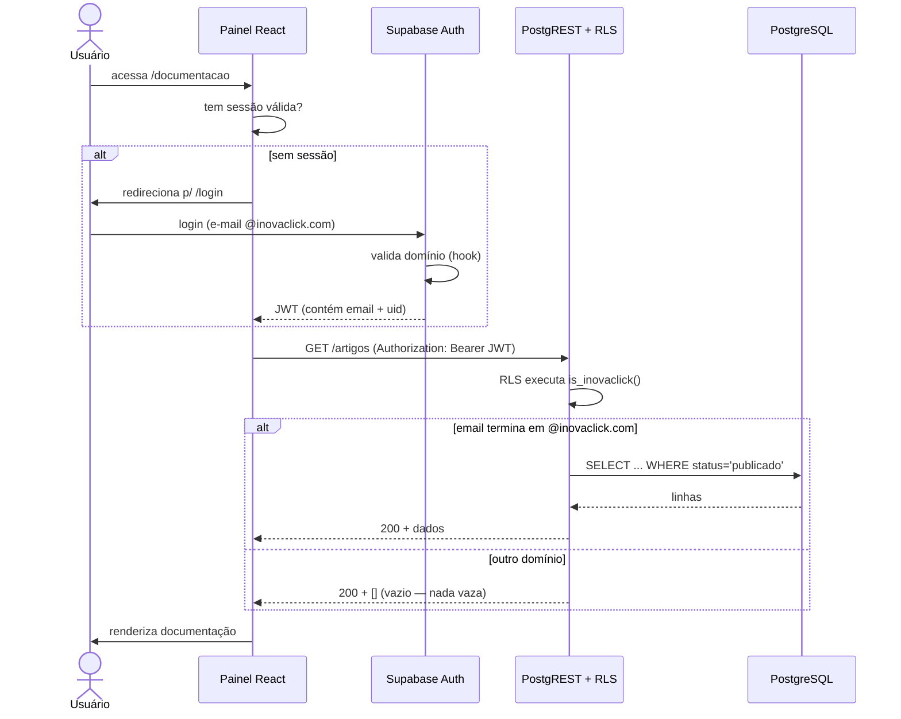

# Análise Técnica e Proposta de Arquitetura — Central de Ajuda VEXSOFT

**Projeto:** `checklist-guidebook` (Painel de Ajuda / Documentação VEXSOFT)
**Stack atual:** Vite + React 18 + TypeScript + shadcn/ui + React Router + TanStack Query
**Backend proposto:** Supabase (PostgreSQL + PostgREST + Auth + RLS + Edge Functions)
**Data:** 26/06/2026
**Autor da análise:** Avaliação técnica assistida

---

## Sumário executivo (recomendação em uma frase)

Migrar o conteúdo dos arquivos `.tsx` para um **modelo relacional no Supabase** (tabelas `categorias` e `artigos`, com `conteudo` em **Markdown**), expor os dados pela **API REST automática do PostgREST** protegida por **Row Level Security restrita ao domínio `@inovaclick.com`**, e manter o front-end React apenas como camada de apresentação. Essa é a **solução híbrida** (banco para metadados/estrutura + Markdown para o corpo do artigo) e atende simultaneamente manutenção, segurança, performance e escalabilidade — sem você precisar construir e hospedar um backend próprio.

O restante deste documento justifica essa recomendação em detalhe.

---

## 1. Avaliação da estrutura atual

### 1.1 Como a documentação está implementada hoje

Cada artigo é um **componente React** em `src/pages/*.tsx`, com o conteúdo escrito diretamente em estruturas JavaScript. Exemplo real de `ConfigurarChecklist.tsx`:

```tsx
const steps = [
  {
    id: "painel",
    title: "Entrar no painel administrativo",
    content: "Acesse app.vexsoft.com.br e faça login...",
    tip: "Certifique-se de que você tenha permissões de administrador...",
  },
  // ...
];
```

Existem **três fontes de verdade independentes** que precisam ser mantidas em sincronia manualmente a cada novo artigo:

| Fonte | Arquivo | O que contém |
|-------|---------|--------------|
| Conteúdo do artigo | `src/pages/<Artigo>.tsx` (~27 arquivos) | Texto, passos, dicas, exemplos |
| Estrutura de navegação | `src/components/DocSidebar.tsx` | Categorias e links da sidebar (array `sections`) |
| Índice de busca | `src/components/SearchBar.tsx` | Array `searchData` (somente título + categoria) |
| Rotas | `src/App.tsx` | Mapeamento manual rota → componente (`lazy()`) |

### 1.2 Pontos positivos da abordagem atual

- **Performance de leitura excelente:** todo o conteúdo é estático, empacotado no build e servido pela CDN do Vercel. Não há latência de banco nem requisições de rede para ler um artigo.
- **Zero custo de infraestrutura de backend:** não há servidor nem banco a manter.
- **Versionamento de conteúdo "de graça" via Git:** toda alteração de texto fica no histórico, com diff, autor e possibilidade de revisão por Pull Request.
- **Tipo seguro:** o TypeScript valida a forma do conteúdo em tempo de compilação.
- **Funciona offline / sem dependências externas** para renderizar a documentação.

### 1.3 Pontos negativos e problemas

**Manutenção**
- Publicar ou editar um artigo exige **alterar código, fazer commit, push e deploy** — inviável para quem não é desenvolvedor (a equipe de conteúdo/suporte fica dependente de um dev).
- Cada novo artigo obriga a editar **4 arquivos** (página, sidebar, busca, rotas). É fácil esquecer um e gerar inconsistência (ex.: artigo que existe mas não aparece na busca, ou aparece na sidebar e dá 404).
- Conteúdo e apresentação estão **acoplados**: mudar o texto e mudar o layout são a mesma operação, no mesmo arquivo.

**Versionamento**
- O versionamento via Git é bom para *código*, mas ruim para *conteúdo editorial*: não há fluxo de rascunho/publicado, agendamento, nem histórico legível por um redator. Reverter "a versão do artigo de ontem" significa entender Git.
- Não há separação entre "conteúdo publicado" e "conteúdo em edição".

**Escalabilidade**
- O modelo não escala para dezenas/centenas de artigos: a sidebar e a busca viram arrays gigantes editados à mão.
- A relação artigo → categoria é **implícita** (codificada na string `category` e na ordem da sidebar), não há integridade referencial. Renomear uma categoria exige um *find-and-replace* arriscado.
- Subcategorias hoje são impossíveis sem reescrever os componentes de navegação.

**Performance (do ponto de vista de busca e de bundle)**
- A busca é **apenas por título/categoria** (`searchData` em `SearchBar.tsx`), filtragem `includes()` no cliente. **Não busca no corpo dos artigos** — o vistoriador não encontra um termo que está dentro do texto.
- Todo o conteúdo vai para o **bundle JavaScript**. Conforme a documentação cresce, o tamanho do app cresce junto (mesmo com `lazy()`, cada página é um chunk que precisa ser baixado e parseado).

**Integração**
- Não existe API. O aplicativo dos vistoriadores **não tem como consumir** a documentação — ela só existe dentro deste site React. Qualquer reuso do conteúdo (app mobile, chatbot, outro sistema) é impossível hoje.

**Segurança / controle de acesso**
- A proteção é **somente no front-end** (`ProtectedRoute` em `App.tsx` checando `!!token`). Todo o conteúdo está no bundle público — basta abrir o JavaScript ou as rotas diretas para ler tudo, sem login. **Não há barreira real.**
- O login atual usa o gateway VexSoft por **token de empresa**, sem qualquer restrição ao domínio `@inovaclick.com` exigido.

---

## 2. Arquitetura proposta

### 2.1 Visão geral



### 2.2 Princípios da arquitetura

1. **Separação conteúdo × apresentação:** o banco guarda *o que* é a documentação; o React decide *como* exibir.
2. **API como fonte única:** tanto o painel web quanto o app dos vistoriadores leem dos mesmos endpoints — sem duplicação.
3. **Segurança no backend, não no cliente:** o acesso é decidido por RLS no PostgreSQL com base no JWT. O front-end apenas reflete o que o backend autoriza.
4. **Markdown como formato de corpo:** flexível, portável, renderizável em web e mobile, e fácil de migrar no futuro.

### 2.3 Por que Supabase (e não um backend próprio)

Supabase entrega, *sem você escrever backend*, exatamente as quatro peças que o requisito pede:

- **Banco PostgreSQL** gerenciado (tabelas, integridade referencial, índices, full-text search nativo).
- **API REST automática (PostgREST)** gerada a partir do schema — cada tabela já vira endpoint.
- **Auth** com login por e-mail/senha ou OAuth e **JWT** assinado, com a possibilidade de restringir cadastro/login por domínio.
- **Row Level Security** para implementar a regra "só `@inovaclick.com`" no nível do dado, de forma inviolável pelo cliente.

---

## 3. Modelagem de dados

### 3.1 Diagrama entidade-relacionamento



### 3.2 DDL (PostgreSQL / Supabase)

```sql
-- =========================================================
-- 1. CATEGORIAS (com suporte a subcategorias via parent_id)
-- =========================================================
create table public.categorias (
  id          uuid primary key default gen_random_uuid(),
  nome        text not null,
  slug        text not null unique,
  descricao   text,
  icone       text,                         -- nome do ícone lucide (ex.: "Settings")
  parent_id   uuid references public.categorias(id) on delete set null,
  ordem       int  not null default 0,      -- ordenação na sidebar
  ativo       boolean not null default true,
  created_at  timestamptz not null default now(),
  updated_at  timestamptz not null default now()
);

create index idx_categorias_parent on public.categorias(parent_id);
create index idx_categorias_ordem  on public.categorias(ordem);

-- =========================================================
-- 2. ARTIGOS (cada artigo pertence a UMA categoria)
-- =========================================================
create table public.artigos (
  id             uuid primary key default gen_random_uuid(),
  categoria_id   uuid not null references public.categorias(id) on delete restrict,
  titulo         text not null,
  slug           text not null unique,
  resumo         text,                       -- usado em cards e resultados de busca
  conteudo       text not null,              -- corpo em Markdown
  status         text not null default 'rascunho'
                 check (status in ('rascunho','publicado','arquivado')),
  ordem          int  not null default 0,
  visualizacoes  int  not null default 0,
  busca          tsvector,                   -- índice full-text (preenchido por trigger)
  published_at   timestamptz,
  created_at     timestamptz not null default now(),
  updated_at     timestamptz not null default now()
);

create index idx_artigos_categoria on public.artigos(categoria_id);
create index idx_artigos_status     on public.artigos(status);
create index idx_artigos_busca      on public.artigos using gin(busca);

-- =========================================================
-- 3. TAGS e relação N:N (busca por palavra-chave / filtros)
-- =========================================================
create table public.tags (
  id   uuid primary key default gen_random_uuid(),
  nome text not null,
  slug text not null unique
);

create table public.artigo_tags (
  artigo_id uuid references public.artigos(id) on delete cascade,
  tag_id    uuid references public.tags(id)    on delete cascade,
  primary key (artigo_id, tag_id)
);

-- =========================================================
-- 4. FAVORITOS (por usuário autenticado)
-- =========================================================
create table public.favoritos (
  user_id    uuid not null references auth.users(id) on delete cascade,
  artigo_id  uuid not null references public.artigos(id) on delete cascade,
  created_at timestamptz not null default now(),
  primary key (user_id, artigo_id)
);

-- =========================================================
-- 5. ARTIGOS RELACIONADOS (curadoria manual N:N)
-- =========================================================
create table public.artigos_relacionados (
  artigo_id     uuid references public.artigos(id) on delete cascade,
  relacionado_id uuid references public.artigos(id) on delete cascade,
  primary key (artigo_id, relacionado_id),
  check (artigo_id <> relacionado_id)
);
```

### 3.3 Trigger de busca full-text (em português)

```sql
create or replace function public.artigos_tsvector_update()
returns trigger language plpgsql as $$
begin
  new.busca :=
    setweight(to_tsvector('portuguese', coalesce(new.titulo,'')), 'A') ||
    setweight(to_tsvector('portuguese', coalesce(new.resumo,'')), 'B') ||
    setweight(to_tsvector('portuguese', coalesce(new.conteudo,'')), 'C');
  new.updated_at := now();
  return new;
end $$;

create trigger trg_artigos_tsvector
  before insert or update on public.artigos
  for each row execute function public.artigos_tsvector_update();
```

> **Subcategorias futuras:** já contempladas pelo campo autorreferente `parent_id` em `categorias`. Uma categoria sem `parent_id` é raiz; com `parent_id` é subcategoria. Nenhuma migração estrutural será necessária para ativar isso depois.

---

## 4. Controle de acesso — restrição ao domínio `@inovaclick.com`

> **Decisão adotada:** toda a documentação (painel web **e** API) é visível **apenas para usuários autenticados com e-mail do domínio `@inovaclick.com`**.

### 4.1 Onde implementar: backend, frontend ou ambos?

**Resposta: ambos, mas a barreira real é no backend.**

| Camada | Papel | Segurança real? |
|--------|-------|-----------------|
| **Frontend** (React) | UX: esconder telas, redirecionar para login, mostrar mensagem amigável | ❌ Não — pode ser burlado abrindo o JS/console |
| **Backend** (Supabase Auth + RLS) | Garantir que nenhum dado saia do banco para quem não é `@inovaclick.com` | ✅ Sim — inviolável pelo cliente |

A falha crítica de hoje é confiar **só no frontend**. A correção essencial é mover a decisão para o banco via **RLS**, de modo que mesmo uma chamada direta à API com um JWT de outro domínio retorne vazio.

### 4.2 Restrição na autenticação (duas barreiras)

**Barreira 1 — bloquear o cadastro/login fora do domínio.** Usando um *Auth Hook* (`before-user-created`) ou um trigger em `auth.users`:

```sql
-- Impede que qualquer conta sem @inovaclick.com seja criada
create or replace function public.bloquear_dominio_externo()
returns trigger language plpgsql security definer as $$
begin
  if new.email !~* '@inovaclick\.com$' then
    raise exception 'Acesso restrito a contas @inovaclick.com';
  end if;
  return new;
end $$;

create trigger trg_bloquear_dominio
  before insert on auth.users
  for each row execute function public.bloquear_dominio_externo();
```

> Em produção, prefira o **Auth Hook** nativo do Supabase (configurável no dashboard) e/ou **Google Workspace SSO restrito ao domínio** — assim só quem tem conta corporativa Google `@inovaclick.com` consegue entrar, eliminando senhas.

**Barreira 2 — RLS validando o domínio em cada leitura.** Mesmo que um JWT externo exista, as políticas abaixo garantem retorno vazio:

```sql
-- Função utilitária: o usuário atual é do domínio?
create or replace function public.is_inovaclick()
returns boolean language sql stable as $$
  select coalesce(auth.jwt() ->> 'email', '') ~* '@inovaclick\.com$';
$$;

-- Ativar RLS
alter table public.categorias enable row level security;
alter table public.artigos    enable row level security;
alter table public.favoritos  enable row level security;

-- Leitura permitida só para o domínio, e só conteúdo publicado/ativo
create policy "ler categorias (inovaclick)" on public.categorias
  for select using ( public.is_inovaclick() and ativo = true );

create policy "ler artigos publicados (inovaclick)" on public.artigos
  for select using ( public.is_inovaclick() and status = 'publicado' );

-- Favoritos: cada um vê/gerencia os seus
create policy "meus favoritos" on public.favoritos
  for all using ( auth.uid() = user_id )
  with check ( auth.uid() = user_id and public.is_inovaclick() );
```

Para **edição** (criar/editar artigos), recomenda-se um campo de papel (`role`) e políticas `insert/update` restritas a editores — mas isso é uma extensão, não um requisito atual.

### 4.3 Fluxo de autenticação e autorização



**Resumo da segurança:** o conteúdo deixa de estar no bundle público (passa a vir da API sob demanda), e nenhum dado é retornado sem um JWT `@inovaclick.com` válido. A proteção frontend continua existindo apenas para a experiência (redirecionar, evitar telas em branco).

---

## 5. Estrutura da API

Com Supabase, a maior parte dos endpoints é **gerada automaticamente** pelo PostgREST a partir do schema. Abaixo, o mapeamento de cada requisito.

### 5.1 Endpoints REST automáticos (PostgREST)

| Requisito | Método + Endpoint | Observações |
|-----------|-------------------|-------------|
| **Listar categorias** | `GET /rest/v1/categorias?select=*&ativo=eq.true&order=ordem` | Filtra raízes com `parent_id=is.null` |
| **Endpoint próprio por categoria** | `GET /rest/v1/artigos?categoria_id=eq.{id}&status=eq.publicado&order=ordem` | "Cada categoria tem seu endpoint" = filtro por `categoria_id`. Para URL limpa por slug, usar a RPC abaixo |
| **Listar artigos por categoria (com join)** | `GET /rest/v1/categorias?select=*,artigos(*)&slug=eq.{slug}` | Retorna a categoria e seus artigos aninhados numa só chamada |
| **Obter artigo por ID** | `GET /rest/v1/artigos?id=eq.{id}&select=*,categorias(nome,slug),tags(*)` | Inclui categoria e tags |
| **Obter artigo por slug** | `GET /rest/v1/artigos?slug=eq.{slug}&select=*` | URLs amigáveis |
| **Buscar artigos** | `GET /rest/v1/artigos?busca=fts(portuguese).{termo}` | Full-text nativo; ou a RPC `buscar_artigos` para ranqueamento |
| **Favoritar / desfavoritar** | `POST` / `DELETE /rest/v1/favoritos` | Protegido por RLS (só o próprio usuário) |
| **Incrementar visualização** | `POST /rest/v1/rpc/incrementar_visualizacao` | RPC dedicada |

Todas as chamadas exigem o header `Authorization: Bearer <JWT>` e a `apikey` pública do Supabase. Sem JWT do domínio, RLS devolve vazio.

### 5.2 RPCs (funções) para casos que merecem endpoint dedicado

```sql
-- Busca com ranqueamento por relevância (consumida pelo app e pelo painel)
create or replace function public.buscar_artigos(termo text)
returns table (
  id uuid, titulo text, resumo text, slug text,
  categoria text, relevancia real
) language sql stable as $$
  select a.id, a.titulo, a.resumo, a.slug,
         c.nome as categoria,
         ts_rank(a.busca, websearch_to_tsquery('portuguese', termo)) as relevancia
  from public.artigos a
  join public.categorias c on c.id = a.categoria_id
  where a.status = 'publicado'
    and a.busca @@ websearch_to_tsquery('portuguese', termo)
  order by relevancia desc
  limit 30;
$$;
-- Consumo:  POST /rest/v1/rpc/buscar_artigos   body: { "termo": "checklist offline" }
```

### 5.3 Conteúdo "formatado para exibição no app"

O campo `conteudo` é armazenado em **Markdown**. A API entrega o Markdown cru; a renderização acontece no cliente:

- **Painel web:** biblioteca como `react-markdown` (+ `remark-gfm`) — substitui os componentes hardcoded atuais.
- **App dos vistoriadores:** qualquer renderizador de Markdown da plataforma (ex.: `flutter_markdown`, `react-native-markdown-display`).

Vantagem: **um único formato** serve todos os clientes, e o conteúdo nunca fica preso a componentes React específicos. Se o app precisar de HTML pronto, uma Edge Function pode converter Markdown→HTML server-side e cachear.

### 5.4 "Cada categoria tem um endpoint próprio"

Interpretando o requisito: cada categoria é acessível por uma URL estável e previsível. Duas formas, ambas suportadas:

1. **Por filtro (nativo):** `GET /rest/v1/artigos?categoria_id=eq.<uuid>` — já funciona sem código.
2. **Por slug amigável (recomendado p/ o app):** uma Edge Function ou rota de gateway expõe `GET /api/categorias/{slug}/artigos`, internamente traduzindo o slug para a consulta acima. Isso dá URLs limpas (`/api/categorias/configuracoes/artigos`) e desacopla o app dos UUIDs.

---

## 6. Onde armazenar o conteúdo — comparativo

| Critério | Banco de dados (SQL) | Arquivos Markdown (no repo) | CMS headless (Strapi/Contentful/etc.) | **Híbrido (DB + corpo Markdown)** |
|----------|----------------------|------------------------------|----------------------------------------|-----------------------------------|
| Edição por não-devs | ✅ via painel admin | ❌ exige Git | ✅ excelente | ✅ via painel admin |
| API pronta para o app | ✅ (PostgREST) | ❌ precisa build/servidor | ✅ | ✅ (PostgREST) |
| Busca full-text | ✅ nativa (tsvector) | ⚠️ índice próprio | ✅ (alguns) | ✅ nativa |
| Versionamento editorial | ⚠️ exige tabela de histórico | ✅ Git nativo | ✅ embutido | ⚠️/✅ histórico + export Git |
| Integridade (artigo↔categoria) | ✅ FK | ❌ convenção | ✅ | ✅ FK |
| Custo / operação | ✅ baixo (Supabase free/pro) | ✅ zero | ❌ mais um serviço a manter/pagar | ✅ baixo |
| Performance de leitura | ✅ com índice/cache | ✅ estático | ✅ com CDN | ✅ |
| Controle de acesso por domínio | ✅ RLS | ❌ tudo público no build | ⚠️ depende do plano | ✅ RLS |
| Portabilidade do conteúdo | ⚠️ export necessário | ✅ texto puro | ⚠️ lock-in | ✅ corpo é Markdown puro |
| Esforço de implantação | ✅ baixo (já tem Supabase) | ✅ baixo | ❌ alto | ✅ baixo |

**Leitura do comparativo:**
- **Markdown puro no repo** mantém o problema central de hoje (edição só por dev, sem API real, sem controle de acesso). Resolve organização, não escalabilidade nem integração.
- **CMS headless** é poderoso, mas adiciona um serviço inteiro para manter/pagar e provável *lock-in*, desproporcional para o tamanho atual.
- **Banco puro** resolve tudo, mas guardar o corpo como texto rico no banco sem um formato portável dificulta migração futura.
- **Híbrido (recomendado):** metadados e relações no PostgreSQL (categoria, ordem, tags, status, busca) + **corpo do artigo em Markdown dentro do campo `conteudo`**. Junta o melhor: edição por painel, API automática, RLS, busca nativa e um corpo de artigo que continua sendo texto portável (fácil de exportar para Git ou outro sistema depois).

---

## 7. Experiência do usuário (vistoriadores)

A modelagem proposta habilita, sem trabalho extra de dados:

- **Navegação por categorias e subcategorias:** a sidebar passa a ser gerada a partir de `GET /categorias` (ordenada por `ordem`, hierarquia por `parent_id`) — acaba a manutenção manual do array em `DocSidebar.tsx`.
- **Busca real por palavra-chave:** `buscar_artigos()` pesquisa **título, resumo e corpo** com ranqueamento e suporte a português (acentuação, radicais). Resolve a limitação atual de buscar só títulos.
- **Filtro por tags:** via `artigo_tags`, permite "ver tudo sobre `offline`" ou `sincronização`.
- **Artigos relacionados:** seção "Veja também" alimentada por `artigos_relacionados` (curadoria) e/ou por tags em comum (automático).
- **Favoritos:** cada vistoriador marca artigos para acesso rápido (`favoritos`), exibidos numa aba "Meus favoritos".
- **Mais acessados / sugeridos:** o contador `visualizacoes` permite uma seção "Artigos populares".
- **Indicadores de frescor:** `published_at` / `updated_at` mostram "Atualizado em…", aumentando a confiança no conteúdo.

Sugestão de hierarquia de navegação (reaproveitando as categorias que já existem na sidebar atual): *Início → Primeiros Passos → Painel Administrativo → Configurações → Gestão de Pátios → Integração & API → Solução de Problemas → FAQ → Suporte → Changelog*.

---

## 8. Plano de migração (resumo)

1. **Criar o schema** no Supabase (seções 3 e 4 deste documento via uma migration).
2. **Extrair o conteúdo** dos ~27 arquivos `.tsx` para registros de `artigos` (script de seed; o conteúdo das páginas pode ser convertido para Markdown uma vez).
3. **Popular `categorias`** a partir do array `sections` de `DocSidebar.tsx`.
4. **Adaptar o front-end:** trocar o conteúdo hardcoded por chamadas via TanStack Query (`useQuery`) ao Supabase; renderizar `conteudo` com `react-markdown`. Sidebar e busca passam a ler da API.
5. **Implementar a auth `@inovaclick.com`** (Auth Hook + RLS) e remover a dependência do gateway VexSoft para o controle de acesso da documentação.
6. **Expor os endpoints** para o app dos vistoriadores e validar consumo.
7. **Desligar as três fontes de verdade** antigas (páginas, `searchData`, sidebar estática).

O processo é incremental: dá para migrar categoria por categoria, mantendo o site no ar.

---

## 9. Recomendação final (justificada)

**Adote a solução híbrida sobre Supabase:** PostgreSQL como fonte única (tabelas `categorias` + `artigos` com corpo em Markdown), API REST automática do PostgREST, autenticação restrita a `@inovaclick.com` por Auth Hook, e autorização real por Row Level Security.

**Por que esta é a melhor abordagem para o seu cenário:**

- **Manutenção:** elimina a edição de código para publicar conteúdo e acaba com as três fontes de verdade sincronizadas à mão. A equipe de suporte/conteúdo passa a publicar por um painel, sem depender de deploy.
- **Segurança:** corrige a falha mais grave de hoje — a proteção só no frontend. Com RLS, a regra `@inovaclick.com` é aplicada no banco e não pode ser burlada pelo cliente; o conteúdo deixa de estar exposto no bundle público.
- **Desempenho:** PostgreSQL com índices `gin` entrega busca full-text rápida e real (no corpo dos artigos, não só no título); leitura escala com cache/CDN na frente da API. O bundle do app encolhe porque o conteúdo sai do build.
- **Escalabilidade futura:** o modelo suporta centenas de artigos, subcategorias (via `parent_id`, sem migração estrutural), tags, favoritos e relacionados; e a API já nasce pronta para o app dos vistoriadores e qualquer cliente futuro.
- **Custo e velocidade de entrega:** você **já tem Supabase conectado**. Não há backend para construir nem servidor para manter — o caminho mais curto entre o problema atual e uma arquitetura robusta.

**Por que não as alternativas:** Markdown puro no repositório não resolve nem a edição por não-devs, nem a API, nem o controle de acesso. Um CMS headless resolveria, mas adiciona um serviço inteiro para operar e pagar, com risco de *lock-in*, desproporcional ao tamanho atual da documentação. Guardar o corpo apenas como coluna de texto rica no banco prenderia o conteúdo a este sistema — por isso o **Markdown como formato do corpo** dentro do banco é o detalhe que garante portabilidade sem abrir mão de nenhuma vantagem.

---

### Anexo — mapeamento requisito → seção

| Requisito do pedido | Seção |
|---------------------|-------|
| Avaliar estrutura atual (prós/contras, manutenção, versionamento, escalabilidade, performance) | 1 |
| Nova arquitetura (categorias + artigos, 1 categoria por artigo, subcategorias futuras) | 2, 3 |
| Controle de acesso `@inovaclick.com` (backend/frontend/ambos + segurança) | 4 |
| Integração com o app (endpoint por categoria; listar, buscar, por ID, conteúdo formatado) | 5 |
| Escalabilidade/manutenção (DB vs Markdown vs CMS vs híbrido) | 6 |
| Experiência do usuário (busca, categorias, relacionados, favoritos) | 7 |
| Diagrama da arquitetura | 2.1 |
| Modelagem das tabelas (SQL/ER) | 3 |
| Estrutura dos endpoints | 5 |
| Fluxo de autenticação e autorização | 4.3 |
| Vantagens/desvantagens de cada alternativa | 6 |
| Recomendação final detalhada | 9 |
